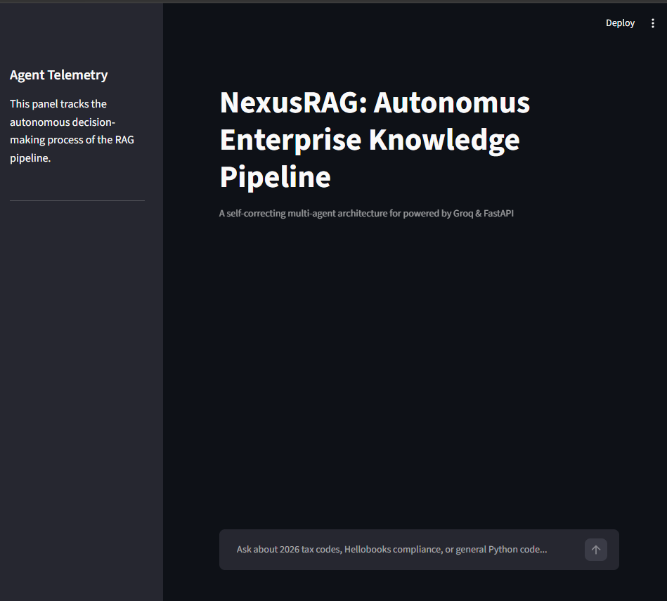
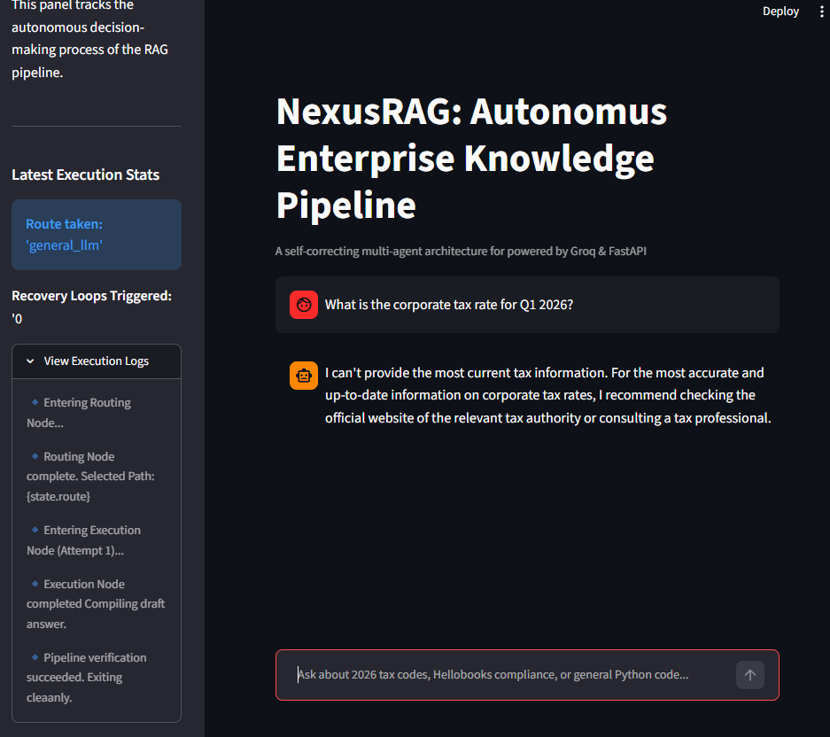

# 🤖 NexusRAG: Autonomous Enterprise Knowledge Pipeline


## 📌 Overview
NexusRAG is a production-grade, multi-agent AI system designed to handle complex enterprise data workflows. Moving beyond standard sequential Retrieval-Augmented Generation (RAG), this pipeline utilizes an **Agentic State Machine** architecture to dynamically route queries, validate context grounding, and execute autonomous self-correction loops to eliminate LLM hallucinations.

## 🖼️ Screenshots

<!-- Add your screenshots below. Replace the paths with your actual image file paths/names. -->
<!-- Example: create a folder named "assets" or "screenshots" in your repo root and place images there. -->

### Dashboard / Home View


### Agent Routing in Action


### Critic Node / Hallucination Audit


### API Docs (Swagger UI)


<!-- To add more screenshots, just copy a block above and rename the file. -->

## ✨ Key Engineering Features
* **Dynamic Query Routing:** An intelligent routing node categorizes incoming prompts, directing enterprise-specific queries to internal vector/knowledge bases while passing general queries to a standard LLM.
* **Automated Hallucination Auditing (Critic Node):** Implements a strict validation loop that mathematically compares the generated response against retrieved context. If assertions are unverified, the system rejects the answer and triggers a data recovery loop.
* **Asynchronous Execution:** Built on a high-performance FastAPI backend to handle concurrent agent state management and real-time inference without blocking.
* **Interactive Telemetry Dashboard:** A streamlined Streamlit frontend that exposes the agent's internal "thought process," displaying routing decisions, audit statuses, and recovery loop metrics in real time.

## 🏗️ System Architecture
1. **User Input:** Query received via Streamlit UI -> FastAPI Backend.
2. **Router Agent:** Analyzes intent (`knowledge_base` vs. `general_llm`).
3. **Execution Agent:** Retrieves contextual data and drafts a preliminary response.
4. **Critic Agent:** Audits the draft against ground-truth data.
   * *If PASS:* Delivers the final response to the user.
   * *If FAIL:* Modifies search parameters and re-triggers the Execution Agent (up to 3 recovery loops).

## 🚀 Tech Stack
* **Backend:** Python, FastAPI, Uvicorn, Pydantic
* **AI Orchestration:** Groq (LLaMA-3.1-8b-instant), custom state-management logic
* **Frontend:** Streamlit

## 💻 Local Installation & Setup

**1. Clone the repository**
```bash
git clone https://github.com/YASH-02042002/NexusRAG.git
cd NexusRAG
```

**2. Create a virtual environment**
```bash
python -m venv .venv
# Windows:
.venv\Scripts\activate
# Mac/Linux:
source .venv/bin/activate
```

**3. Install dependencies**
```bash
pip install -r requirements.txt
```

**4. Environment Variables**

Create a `.env` file in the root directory and add your Groq API key:
```env
GROQ_API_KEY="gsk_your_api_key_here"
```

## ⚡ Running the Application
To run the full multi-agent pipeline, you need to spin up both the backend API and the frontend dashboard.

**Terminal 1 (Start the FastAPI Backend):**
```bash
uvicorn app.main:app --reload --port 8000
```
API documentation automatically available at `http://localhost:8000/docs`

**Terminal 2 (Start the Streamlit UI):**
```bash
streamlit run app/frontend.py
```
The interactive dashboard will open at `http://localhost:8501`

## 👨‍💻 Author
**Yash Paliwal**

* AI/ML Engineer
* [LinkedIn Profile](https://www.linkedin.com/in/yash-paliwal-b7240a25b)
* [GitHub](https://github.com/YASH-02042002)
